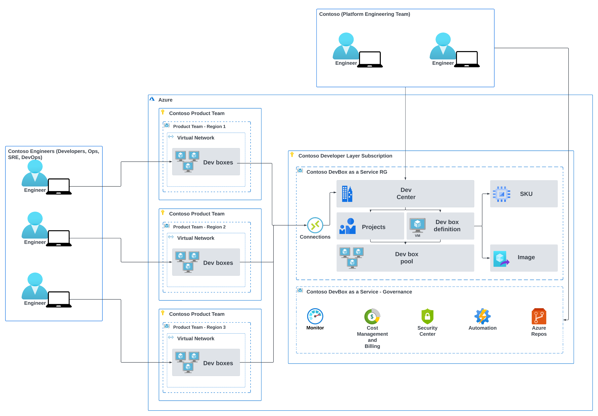

# Dev Experience with Microsoft DevBox

Welcome to the Dev Experience with Microsoft DevBox repository! This repository demonstrates how to deploy Microsoft DevBox for Contoso's Software Development Engineers to expedite their onboarding process and streamline project integration.

## Build and Deploy Status

| Build | Deploy |
|:-----:|:------:|
|  |   |

## Solution Architecture

